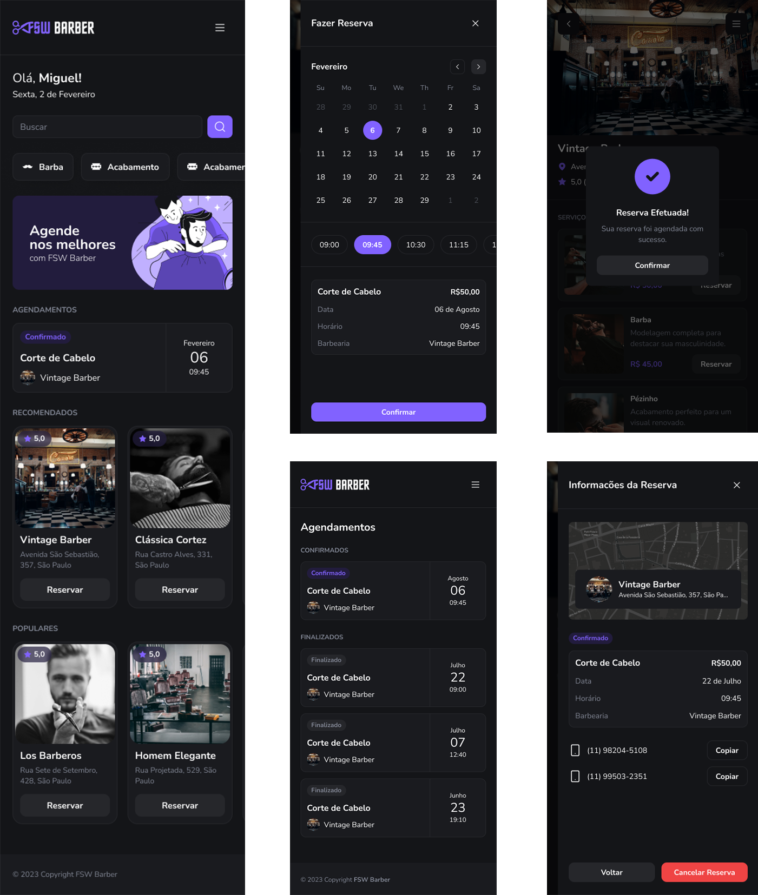

<h1 align="center">FSW 5 - Barber</h1>

  
  
  
  
  
  

  
  
  
  

 

  

 

## 💻 Projeto

Projeto de um gerenciador de barbearias com funcionalidades como agendamento de serviços, busca por serviços/barbearias, visualização de horários disponíveis, login com Google, etc. Desenvolvido durante o evento FSW 5 - Barber, da Full Stack Club.

## 🔖 Layout

Você pode visualizar o layout do projeto clicando [aqui](https://www.figma.com/design/jMzRq8rks94mr4pKyicwCK/FSW-Barber?node-id=0-1&p=f&t=fAM01pSrfGtHwQ1t-0).